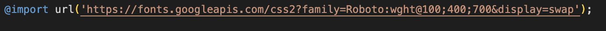

# Jason Blackburn - Milestone Project 3 My Gig Tickets

This site is to be used by the user to find out what the weather is in various locations around the globe.

# Table of Contents

1. [Business](#business)
2. [Colour Scheme](#color-scheme)
3. [Wireframes](#wireframes)
4. [Technologies Used](#technologies-used)
5. [Testing](#testing)
6. [Deployment](#deployment)
7. [Credits](#credits)
8. [Media](#media)

# Business 

The business goal of this page is to allow users to upload the names of their favourite artists, which are then stored in a database. After this the user can then submit information about events they've seen and link the events to specific artists.

## External Users Goals

The external users goals of this page are to provide a database for users to store information on events they've been to in the past. In the future I'd like to add a feature where you can upload images and videos to the events. I would also like to develop an account system where each list of artists and events would be stored in specific database for each account. 

## Site Owners Goals

The site owners goals of this page are to provide a platform for users to store past events to keep track of.

# Colour Scheme 

The site uses a fairly plain colour scheme with elements of bright colour to draw the user to certain features such as buttons. The main body is a slight grey colour whereas the header and footer are a darker grey. Most of the buttons feature a bright pink colour with a green colour on hover. 

## Font Family

I have used a font from Google Fonts named Roboto.

# Wireframes 

I have made wire frames for desktop and mobile. These can be seen below. I've hidden the hero image on the mobile view to make the layout less busy on smaller screens.

# Technologies Used 

During the build for this page I used:

[HTML](https://developer.mozilla.org/en-US/docs/Glossary/HTML5)

The project uses HTML to create the content.

[CSS](https://developer.mozilla.org/en-US/docs/Web/CSS)

The project uses CSS to style some of the elements, and also makes some of the elements responsive.

[JavaScript](https://developer.mozilla.org/en-US/docs/Web/JavaScript)

The project uses JavaScipt to make the project interactive.

[Python](https://developer.mozilla.org/en-US/docs/Glossary/Python)

I used python as part of the backend.

[Flask](https://flask.palletsprojects.com/en/2.3.x/)

I used Flask as a template language.

[SQL](https://www.postgresql.org/)

I used PostgreSQL for my database creation.

[Materialize](https://materializecss.com/)

I used Materialize as the framework to handle most of the CSS.

[GitHub](https://github.com/)

Project Repository.

VSCode

I used VS Code to build this project.

[Heroku](https://heroku.com)

I have used Heroku to deploy this project.

Live Link: https://my-gig-tickets.herokuapp.com/

# Testing 

“PLEASE NOTE - There is an error showing. The error claims that some external font/icon files have not been loaded. But having investigated this with my mentor, we can clearly see all items have loaded and this error is incorrect.”

This project was tested using:

[W3 HTML Validator](https://validator.w3.org/)

The W3 Schools HTML Validator - returning 0 errors (except those caused by Flask).

[W3 CSS Validator](https://jigsaw.w3.org/css-validator/)

The W3 Schools CSS Validator - returning 0 errors.

[Google Chrome Lighthouse](https://developer.chrome.com/docs/lighthouse/overview/)

Google Chrome Lighthouse was used to score the performance and accesibility of this site.

| User Story                                                                                              | User Case                                                                                                                                                      | Pass/Fail |     |     |
| ------------------------------------------------------------------------------------------------------- | -------------------------------------------------------------------------------------------------------------------------------------------------------------- | --------- | --- | --- |
| User Story 001 - (Consumer) As a consumer I want to be able to easily add an artist.    | User case 001-001 Easily able to add an artist or event using the forms provided. Users are able to access the add artist form either by selecting the link on the navbar or by pressing the Start button.                        | Pass      |     |     |
|                                                                                                            |     |     |
| User Story 002 - (Consumer) As a consumer I want to be able to edit and delete my artists and events. | User case 002 - 001 The user is able to easily edit or delete both artists and events at the click of a button, the user can also delete all events that are linked to an artist with the use of the cascade property. | Pass      |     |     |

# Deployment 

GitPod -> GitHub -> Heroku

## GitHub

Create GitHub Repository using VS Code. Commited and pushed all content from VS Code to Github.

## Heroku/ElephantSQL

Completed site deployed to Heroku and the live database was created using ElephantSQL.

# Credits 

[Stack Overflow](https://stackoverflow.com/)

I used Stack Overflow to research fixes for some bugs.

## Fonts

[Roboto](https://fonts.google.com/specimen/Roboto)